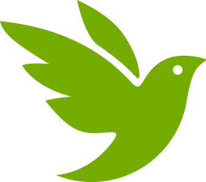
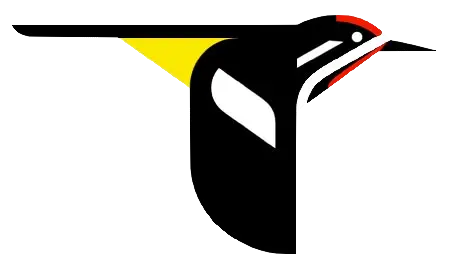

Explore useful birding tools and resources.

<!--more-->

<section>

## iNaturalist

[iNaturalist](https://www.inaturalist.org) is platform to upload observations of all kinds of
life. It hosts powerful image recognition technology and allows users to submit identifications
on each other's observations, resulting in a rich biodiversity database.

If you're passionate about citizen science, iNaturalist a great way to contribute data
to scientific research!

Several projects on iNaturalist track the birds on campus and Philadelphia:

- [Bird Aware Penn](https://www.inaturalist.org/projects/bird-aware-penn)
- [Penn Bird Strikes](www.inaturalist.org/projects/penn-bird-strikes)
- [Philly Bird Strikes Project](https://www.inaturalist.org/projects/philly-bird-strikes-project)
- [Bird Safe Philly Bird Strikes Project](https://www.inaturalist.org/projects/bird-safe-philly-bird-strikes-project)
- [Bird Safe Philly - OFFICIAL Bird Collision Monitoring Project](https://www.inaturalist.org/projects/bird-safe-philly-official-bird-collision-monitoring-project)

### Seek

[Seek by iNaturalist](https://www.inaturalist.org/pages/seek_app) is another way to identify
the species around you with a simple point of the Seek Camera. Its image recognition is powered
by iNaturalist and it has additional gamified features like achievements, badges and challenges.

Unlike iNaturalist, there is no registration and observations remain on your device.

</section>
<section>

## Cornell Lab

The [Cornell Lab of Ornithology](https://www.birds.cornell.edu/home) hosts many valuable
birding resources!

They host the [Macaulay Library](https://www.macaulaylibrary.org),
a wildlife media archive, and
[_Living Bird_](https://www.allaboutbirds.org/news/living-bird-latest-issue),
their quarterly member magazine.

### All About Birds

[All About Birds](https://www.allaboutbirds.org) is an online guide with a large selection
of bird species. It includes habitat ranges, behavior, high-quality identification photos,
and sound recordings. If you're stuck on an identification, you can even compare with similar
species and get useful tips to tell them apart.

### eBird

[eBird](https://ebird.org/home) collects bird sightings from around the world, allowing birders
to share their trips and findings. The data you contribute helps to inform conservation decisions
and scientific research.

We regularly use eBird to track our outings, and anyone with an eBird account can contribute
to our lists.

### Merlin Bird ID

[The Merlin app](https://merlin.allaboutbirds.org) allows you to indentify birds on the go
with Sound ID, Photo ID, or a questionnaire. Powered by eBird, you can save the birds you have
seen, build custom lists, and filter by location or time of year.

### BirdNET

[BirdNET](https://birdnet.cornell.edu) is an analytical AI specialized for sound identification,
much like Merlin's Sound ID. Besides the official app by the Cornell Lab, which processes audio
recordings on their servers, it run on a variety of hardware or through a different client app.

</section>
